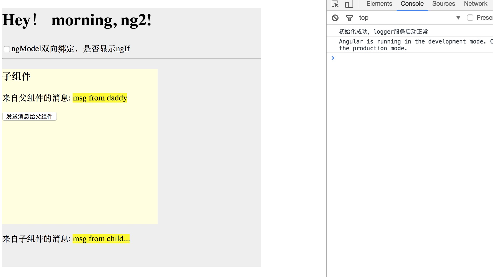

# angular-hi
say hi to angular2

## branches

```
➜  angular-hi git:(master) ✗ git branch
  1-app
  2-ngif
  3-directive
  4-service
  5-inputOutput
```

> note:   
> each branch is a technology of ng2. checkout one by one can see all steps.
master and 5-inputOutput are the same.

you can just clone it, then type `ng serve` in the *ng2-hi* folder to see the result.




---
thanks for: http://www.imooc.com/learn/789